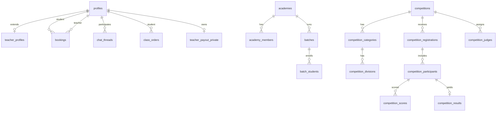

# Yogstra V2 — Entity Relationship Diagram

Last updated: Sprint 1 database consolidation.

All primary keys are `uuid`. Timestamps use `timestamptz`. Unless noted, mutable tables include `created_at` and `updated_at`.

## High-level domains

## Core identity & marketplace

| Table | PK | Key FKs | Cascade rules |
|-------|-----|---------|---------------|
| `profiles` | `id` → `auth.users` | — | DELETE CASCADE from auth |
| `teacher_profiles` | `id` → `profiles` | — | CASCADE |
| `bookings` | `id` | `student_id`, `teacher_id` → profiles | CASCADE |
| `schedules` | `id` | `teacher_id`, `student_id` → profiles | CASCADE |
| `class_orders` | `id` | student, teacher, thread, schedule | CASCADE / SET NULL |
| `payouts` | `id` | `teacher_id`, `class_order_id` | CASCADE / SET NULL |
| `teacher_payout_private` | `teacher_id` | → profiles | CASCADE |

## Chat & realtime

| Table | PK | Notes |
|-------|-----|-------|
| `chat_threads` | `id` | Ordered pair constraint `participant_a < participant_b` |
| `direct_messages` | `id` | CASCADE from thread |
| `chat_thread_reads` | `(thread_id, user_id)` | Composite PK |
| `chat_thread_settings` | `(thread_id, user_id)` | Per-user mute/block/clear |
| `chat_reports` | `id` | Admin review workflow |
| `direct_video_calls` | `id` | LiveKit signaling |
| `messages` | `id` | Legacy booking-scoped chat |

## Academy domain

| Table | PK | `created_by` | Key FKs |
|-------|-----|--------------|---------|
| `academies` | `id` | ✓ | `parent_academy_id` → self SET NULL |
| `academy_settings` | `academy_id` | — | CASCADE |
| `academy_members` | `id` | — | academy, user CASCADE |
| `teacher_academies` | `id` | — | academy, teacher CASCADE |
| `batches` | `id` | — | academy CASCADE, branch SET NULL |
| `batch_students` | `id` | — | batch CASCADE, student CASCADE |

**Cross-links:** `bookings.academy_id`, `schedules.batch_id`, `competition_registrations.academy_id` / `batch_id`.

## Competition domain (12 tables)

| Table | PK | `created_by` | Notable constraints |
|-------|-----|--------------|---------------------|
| `competitions` | `id` | ✓ | Unique `slug`; dates check |
| `competition_events` | `id` | — | CASCADE from competition |
| `competition_categories` | `id` | — | CASCADE |
| `competition_divisions` | `id` | — | CASCADE from category |
| `competition_registrations` | `id` | — | registrant CASCADE |
| `competition_participants` | `id` | — | Unique (competition, student, category) |
| `competition_judges` | `id` | — | Unique (competition, user) |
| `competition_scores` | `id` | — | Unique (participant, judge, event) |
| `competition_results` | `id` | — | Unique participant |
| `competition_certificates` | `id` | — | Unique QR token |
| `competition_rankings` | `id` | — | Polymorphic `subject_id` |
| `competition_announcements` | `id` | ✓ | CASCADE |

### Competition RLS helpers

- `is_competition_organizer(competition_id)`
- `is_competition_judge(competition_id)`
- `is_competition_participant(competition_id)`
- `can_manage_competition(competition_id)`
- `can_view_competition(competition_id)`
- `can_register_for_competition(competition_id)`
- `can_score_competition(competition_id)`

## Index strategy

- **FK columns:** indexed on all high-cardinality foreign keys
- **Status filters:** composite indexes `(parent_id, status)` on registrations, batches, competitions
- **Partial indexes:** Razorpay IDs, pinned posts, active coupons
- **Leaderboards:** `(scope, rank)`, `(subject_type, subject_id)` on rankings

## UUID standardization

- Primary keys: `uuid default gen_random_uuid()`
- Auth-linked rows: `profiles.id` matches `auth.users.id` (no separate UUID)
- Polymorphic references (`competition_rankings.subject_id`) intentionally omit FK (multi-entity)

## Repository map

| Repository | Tables |
|------------|--------|
| `competitionRepository` | competitions, events, categories, announcements |
| `competitionRegistrationRepository` | registrations, participants |
| `competitionJudgeRepository` | judges, scores, results |
| `competitionCertificateRepository` | certificates |
| `competitionRankingRepository` | rankings |
| `academyRepository` | academies, settings |
| `academyMemberRepository` | members, teacher_academies |
| `batchRepository` | batches, batch_students |

Services remain unchanged; they consume repository interfaces only.
