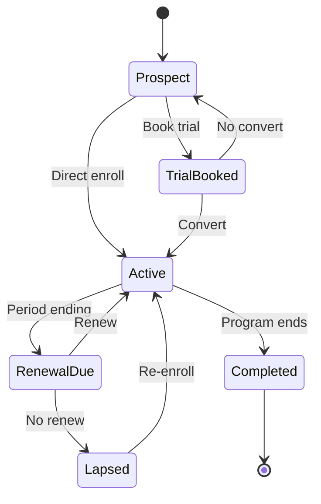
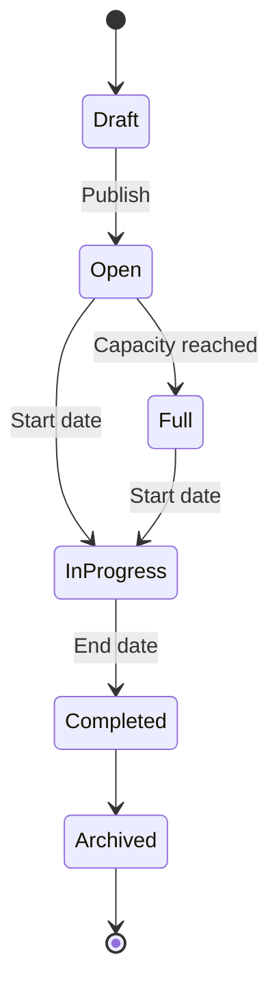

# Product Flow V2 — Yogstra Operating System

**Sprint 8 · Phase 3**  
**Date:** June 30, 2026  
**Status:** Target state — replaces current marketplace flows

---

## Product Positioning

> **Yogstra is the Operating System for Yoga Academies, Teachers, and Competitions.**

Not a marketplace. Not a booking site. A professional training platform where:
- **Students** join programs, track progress, and compete
- **Teachers** run professional coaching businesses
- **Academies** manage batches, teachers, and finances
- **Organizers** run world-class competitions
- **Judges** score with precision

---

## Core Product Flows

### Flow 1: Student Discovers & Enrolls

```
┌──────────┐    ┌──────────┐    ┌──────────┐    ┌──────────┐
│ Discover │───▶│  Profile │───▶│  Trial   │───▶│ Enroll   │
│          │    │  Review  │    │  Class   │    │  Funnel  │
└──────────┘    └──────────┘    └──────────┘    └────┬─────┘
                                                      │
                    ┌──────────┐    ┌──────────┐       │
                    │ Welcome  │◀───│  Payment │◀──────┘
                    │Dashboard │    │ Checkout │
                    └──────────┘    └──────────┘
```

**Key changes from V1:**
- Unified Discover (coaches + academies + programs)
- Premium coach/academy profiles
- Optional trial class before enrollment
- Multi-step enrollment funnel (not single modal)
- Post-payment welcome experience
- Dashboard answers "What do I do today?"

### Flow 2: Teacher Builds Practice

```
┌──────────┐    ┌──────────┐    ┌──────────┐    ┌──────────┐
│  Apply   │───▶│ Complete │───▶│  Create  │───▶│ Publish  │
│  to Teach│    │ Profile  │    │ Programs │    │ Profile  │
└──────────┘    └──────────┘    └──────────┘    └────┬─────┘
                                                      │
                    ┌──────────┐    ┌──────────┐       │
                    │  Manage  │◀───│ Receive  │◀──────┘
                    │ Students │    │Enrollments│
                    └──────────┘    └──────────┘
```

**Key changes from V1:**
- Profile completion during pending state
- Program creation (not just 1-on-1 / group pricing)
- Premium public profile
- Structured student management (attendance, assignments, progress)

### Flow 3: Academy Operations

```
┌──────────┐    ┌──────────┐    ┌──────────┐    ┌──────────┐
│  Create  │───▶│  Invite  │───▶│  Launch  │───▶│  Enroll  │
│ Academy  │    │ Teachers │    │ Programs │    │ Students │
└──────────┘    └──────────┘    └──────────┘    └────┬─────┘
                                                      │
                    ┌──────────┐    ┌──────────┐       │
                    │  Manage  │◀───│  Public  │◀──────┘
                    │ Operations│   │ Profile  │
                    └──────────┘    └──────────┘
```

**Key changes from V1:**
- Dedicated academy onboarding (not student auth)
- Name/email student enrollment (not UUID)
- Public academy profile with enrollment requests
- Batch-native timetable and attendance
- Role-aware navigation

### Flow 4: Competition Lifecycle

```
┌──────────┐    ┌──────────┐    ┌──────────┐    ┌──────────┐
│ Organizer│───▶│ Register │───▶│  Prepare │───▶│  Compete │
│  Creates │    │ Students │    │  (Coach) │    │          │
└──────────┘    └──────────┘    └──────────┘    └────┬─────┘
                                                      │
                    ┌──────────┐    ┌──────────┐       │
                    │Certificate│◀──│  Results │◀─────┘
                    │          │    │ (Judge)  │
                    └──────────┘    └──────────┘
```

**Key changes from V1:**
- Organizer onboarding (not teacher register)
- Entry fee payment integration
- Coach preparation tools linked to registration
- Academy batch team entries
- Judge assignment notifications

### Flow 5: Payment & Enrollment

```
Choose Program
      ↓
Choose Batch (schedule, coach, seats)
      ↓
Review Summary (price, policy, inclusions)
      ↓
Apply Coupon (optional)
      ↓
Payment (Razorpay)
      ↓
Confirmation (receipt, enrollment details)
      ↓
Welcome (meet coach, add calendar, first class)
      ↓
Dashboard (Today's view)
```

**Key changes from V1:**
- 7-step funnel replaces single BuyClassModal
- Seat availability shown
- Cancellation policy displayed
- Confirmation email + in-app welcome
- Enrollment record (not "class order")

---

## Domain Integration Model

### V1 (Current) — Three Silos

```
Marketplace          Academy              Competition
(discover→buy)       (batches→UUID)        (wizard→judge)
     │                    │                     │
     └──── chat only ─────┴──── no link ────────┘
```

### V2 (Target) — Unified OS

```
                    ┌─────────────────┐
                    │   YOGSTRA OS    │
                    │                 │
    Student ────────┤  Programs       ├──────── Competitions
    Teacher ────────┤  Enrollments    ├──────── Judging
    Academy ────────┤  Schedules      ├──────── Results
    Organizer ──────┤  Payments       ├──────── Certificates
                    │  Messaging      │
                    └─────────────────┘
```

**Integration points:**
- Student enrolled in batch → appears in academy roster AND teacher students
- Competition registration → linked to coach AND academy batch
- Payment → creates enrollment in all relevant contexts
- Schedule → unified calendar across coach, academy, student views

---

## Entity Model (Product Level)

### Program Types

| Type | Description | Example |
|------|-------------|---------|
| **Foundation Program** | Beginner batch | "Yoga Basics — 8 Weeks" |
| **Advanced Program** | Intermediate+ batch | "Advanced Asana Mastery" |
| **Training Batch** | Ongoing group class | "Weekend Morning Batch" |
| **Personal Coaching** | 1-on-1 sessions | "Private Sessions with Priya" |
| **Competition Camp** | Competition prep | "National Yoga Prep 2026" |
| **Workshop** | Single/multi-day event | "Backbend Intensive Weekend" |
| **Masterclass** | Guest teacher session | "Pranayama with Guru Ji" |
| **Seasonal Camp** | Time-bound intensive | "Summer Yoga Camp 2026" |

### Enrollment Record

Replaces `class_orders` + `bookings` duality:

```
Enrollment {
  student_id
  program_id
  batch_id (optional)
  coach_id
  academy_id (optional)
  status: prospect | trial | active | renewal_due | lapsed | completed
  start_date
  end_date
  payment_id
  coupon_id (optional)
}
```

---

## State Machines

### Enrollment Lifecycle



### Program Lifecycle



---

## Priority Flows for Implementation

| Priority | Flow | Impact | Effort |
|----------|------|--------|--------|
| P0 | Terminology migration | High | Low |
| P0 | Enrollment funnel (Flow 5) | Critical | High |
| P0 | Teacher profile premium (04) | High | Medium |
| P0 | Student Today dashboard (08) | High | Medium |
| P1 | Academy enrollment (09) | High | High |
| P1 | Program creation for teachers (07) | High | High |
| P1 | Post-payment welcome | Medium | Low |
| P2 | Compare coaches/academies | Medium | Medium |
| P2 | Organizer/Judge onboarding | Medium | Medium |
| P2 | Competition fee payment | Medium | Medium |

---

*Detailed specs: 04–12 in this folder*
